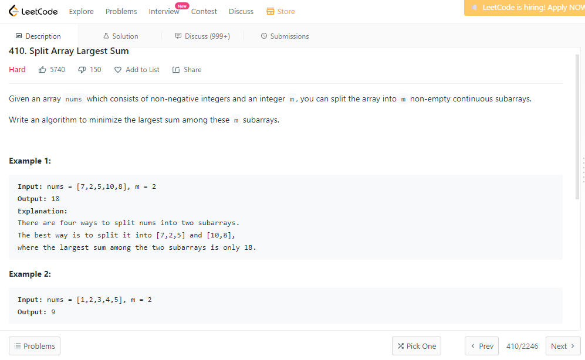

# PD_Dupla25

**Número da Lista**: 5<br>
**Conteúdo da Disciplina**: Programação Dinâmica<br>

## Alunos
|Matrícula | Aluno |
| -- | -- |
| 18/0101617  |  Guilherme de Morais Richter |
| 18/0102613  |  Ítalo Fernandes Sales de Serra |

## Apresentação

Faça o download do vídeo na pasta <b>apresentacao</b>.

Ou clique no link para assistir à apresentação no youtube: <i>https://youtu.be/pe9oSTgIxLA</i>

## Sobre 

Este projeto tem o objetivo de solucionar problemas de competição do juiz online <b>LeetCode</b>, utilizando a técnica de <b>Programação Dinâmica</b>.

Os problemas selecionados foram:

<b>1)</b> - Coin Change - <b>medium</b> - link: https://leetcode.com/problems/coin-change

<b>2)</b> - Triangle - <b>medium</b> - link: https://leetcode.com/problems/triangle/

<b>3)</b> - Jump Game - <b>medium</b> - link: https://leetcode.com/problems/jump-game/

<b>4)</b> - Split Array Largest Sum - <b>hard</b> - link: https://leetcode.com/problems/split-array-largest-sum/

## Screenshots

<b>Screenshot do problema Coin Change .</b>


<b>Accepted do problema Coin Change .</b>
CoinChange.png)

<b>Screenshot do problema Triangle.</b>


<b>Accepted do problema Triangle.</b>
Triangle.png)

<b>Screenshot de Jump Game.</b>


<b>Accepted de Jump Game.</b>
JumpGame.png)

<b>Screenshot de Split Array Largest Sum.</b>


<b>Accepted de Split Array Largest Sum.</b>
SplitArrayLargestSum.png)

## Instalação 

**Linguagem**: Python e C<br>
**Framework**: Não possui<br>

Para se ter os arquivos na sua máquina, é necessário seguir o seguinte passo:

- Clonar o nosso repositório do GitHub para a sua máquina, digitando no terminal (necessário ter o Git instalado):

```python
git clone https://github.com/projeto-de-algoritmos/PD_Dupla25.git
```

Não é necessário instalar linguagem ou framework, pois os algoritmos podem ser executados em seu próprio juiz online de origem.

## Uso 

Como este projeto se trata de exercícios de um juiz online, ao entrar na página de cada problema, como por exemplo, a do Coin Change (link: https://leetcode.com/problems/coin-change), temos a seguinte interface:

<b>Exemplo de submissão.</b>
CoinChange.png)

No exemplo acima, basta copiar o código-fonte do arquivo CoinChange.py, selecionar a linguagem que ele está escrito, no caso Python, e em seguida clicar no botão Submit, no canto inferior direito.

Seguindo esse passo para os outros dois problemas, é possível verificar o funcionamento de todo o projeto.

## Outros 

Não há outras observações.